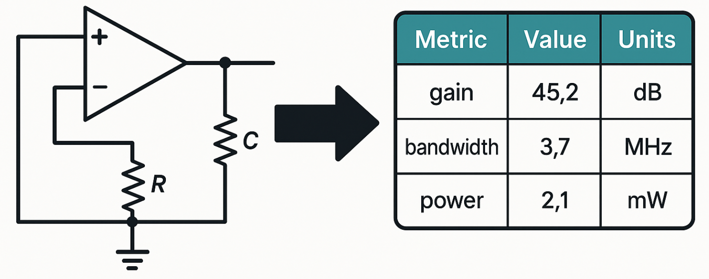

# spmetrics
<div style="text-align: center">

</div>

## Introduction
Important note: This work is still progress, and is expected to update frequenly.

This Python library is used to extract performance metrics (i.e. gain, phase margin, CMRR, etc. ) using NgSPICE simulator. The obtained performance metrics and further used for providing feedback to optimization loops (Reinforcement Learning, Bayesian Optimization, LLMs, etc). The initial version of `spmetrics` is adapted from the public implementation [[LLM-transistor-sizing](https://github.com/eelab-dev/LLM-transistor-sizing)], and may also work well for the main test circuit (`examples/liuLLMbasedAIAgent2025.cir`), however, our main objective is to make the library is more general and can be applied to any analog circuit defined in SPICE language with minimal setup efforts, and our extension to more circuits and make all relevant general is still ongoing.


Characteristics that we take into account when developing `spmetrics` includes:

- **Seperation Circuit Component Definition and Control Blocks**: We aim to make the library more general and highly appliciable to different settings, thus the inputs should be purely define circuit components and their interconnections. We have (and will develop more) `setup_` functions that help to config the input seemlessly, before running the SPICE simulation.
- **Inputs to `compute_` Functions Are Simulation Log Files Only**: To enable reusability, the same simulation log data could be used for different calculations, thus the try to structure the `compute_` functions mainly accept simulation log files as inputs.

## Example

```python
python examples/extract_opamp_metrics.py
```
(make sure `ngspice` is installed, and can be invoked from the same terminal.)

## Testing

```
python -m unittest discover tests
```

```
Metrics                         Values            Unit Conversion
------------------------------  ----------------  -----------------
AC Gain                         100.4385 dB
Transient Gain                  66.0735 dB
Bandwidth                       157.2304 Hz
Unity Gain Bandwidth            12589252.8411 Hz  12.59 MHz
Phase Margin                    54.5044 degrees
Leakage Power                   0.0077 W          7.69 mW
CMRR (Transient)                124.14 dB
CMRR (AC)                       91.9298 dB
Offset Voltage                  0.0004 V          0.40 mV
Output Swing                    1.4404 V
ICMR (Input Common Mode Range)  0.4510 V
```

## Contribution
Any pull requests, open issues and feedback are highly appriciated. 